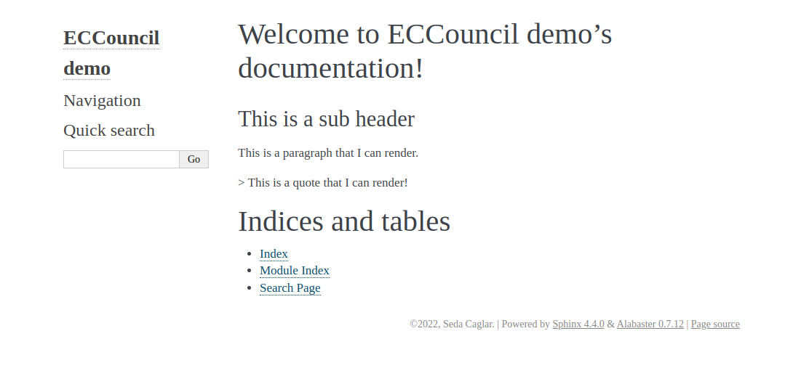
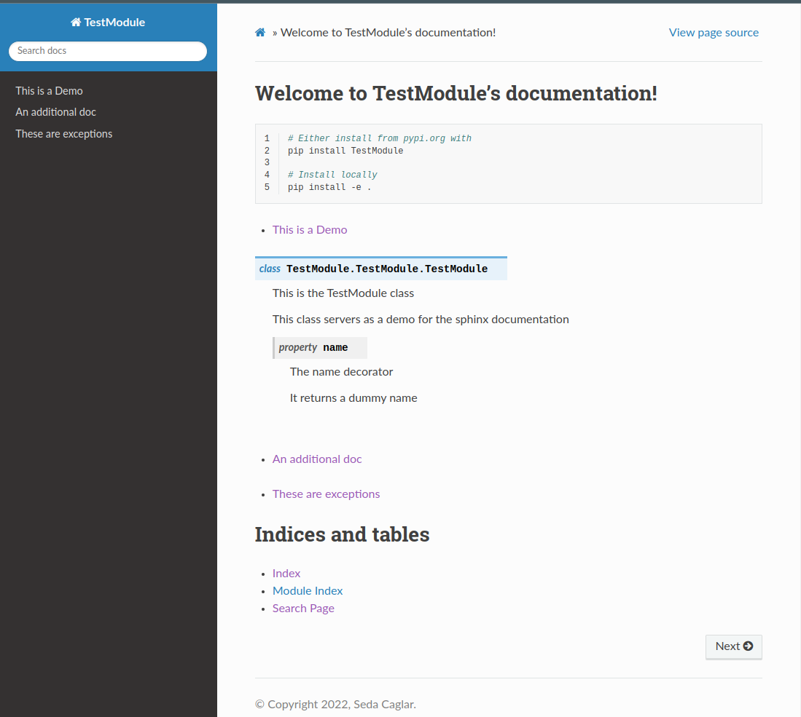

## Section Topics

### 10.1 - Comments and Docstrings

- 01 | Building blocks
    - History of documentation, comments and docstrings
- 02 | Developing the script
    - Showcasing common methods
- 03 | Conclusion
    - Overview of docstrings and comments


### 10.2 - Sphinx Setup

- 01 | Building blocks
    - Installing sphinx
- 02 | Developing the script
    - Creating a project and getting an overview
- 03 | Conclusion
    - Sphinx ready for documentation

#### Commands used in chapters
```
cd sphinx-demo
python3 -m venv env
source env/bin/activate
pip3 install sphinx
sphinx-quickstart .
make html
build/html/index.html
google-chrome build/html/index.html
```
#### A Section of The Project View 


### 10.3 - Sphinx Example

- 01 | Building blocks
    - Project setup, module creation
- 02 | Developing the script
    - Generating documentation with spinx and
    docstrings and customizing them
- 03 | Conclusion
    - Fully fledged documentation

#### Commands used in chapters
```
cd TestModule
python3 -m venv env
source env/bin/activate
pip3 install sphinx_rtd_theme
cd docs
make clean
sphinx-build -t html source build
google-chrome build/index.html
```
#### A Section of The Project View 


### Helpful Resources

[Spinx (Python Document Generator)](https://www.sphinx-doc.org/en/master/)

[Spinx Themes](https://www.writethedocs.org/guide/tools/sphinx-themes/?highlight=sphinx)
