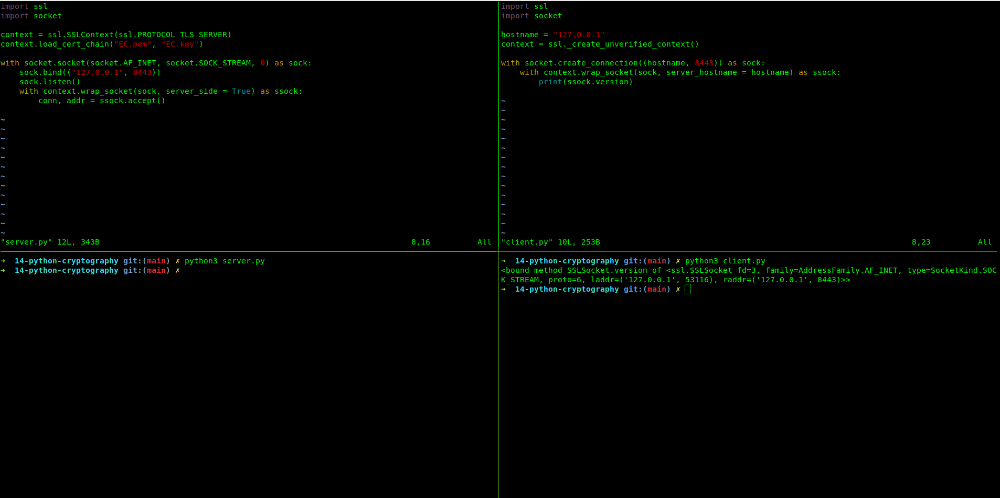

## Section Topics

### 14.1 - Create Password Reset App

- 01 | Building blocks
    - Hashlib, json, ctypes, os, getpass modules of python
- 02 | Developing the script
    - Putting the parts together
- 03 | Conclusion
    - A database for authentication without any knowledge of the actual sensitive
      information.

### 14.2 - Secure Numbers

- 01 | Building blocks
    - String, random, secrets modules of python
- 02 | Developing the script
    - Putting the parts together
- 03 | Conclusion
    - An easy to extend yet crytographically secure random password generator.

### 14.3 - Secure Sockets

- 01 | Building blocks
    - client, server, key, pem
    - The openssl external tool and the build in modules shipping with python.
- 02 | Developing the script
    - Putting the parts together
    - Generating the certificates and implementing the client and the server.
- 03 | Conclusion
    - A versatile demo of a secure socket application
    - Secure means of communication via only a few steps.


#### openssl command

```
openssl req -new -x509 -nodes -out EC.pem -keyout EC.key
```

#### Run Project (server.py, client.py)

