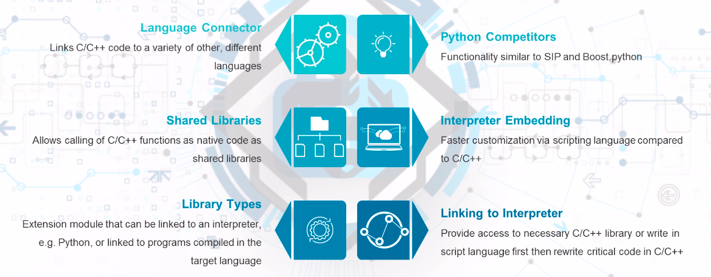
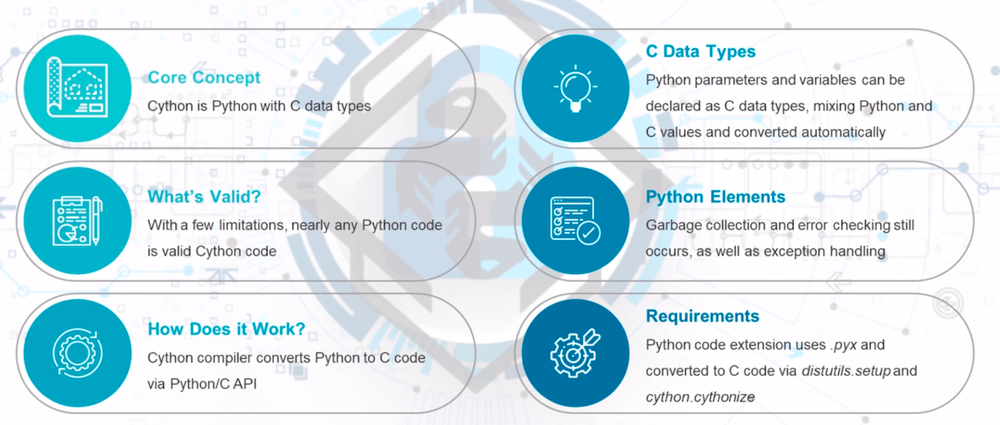
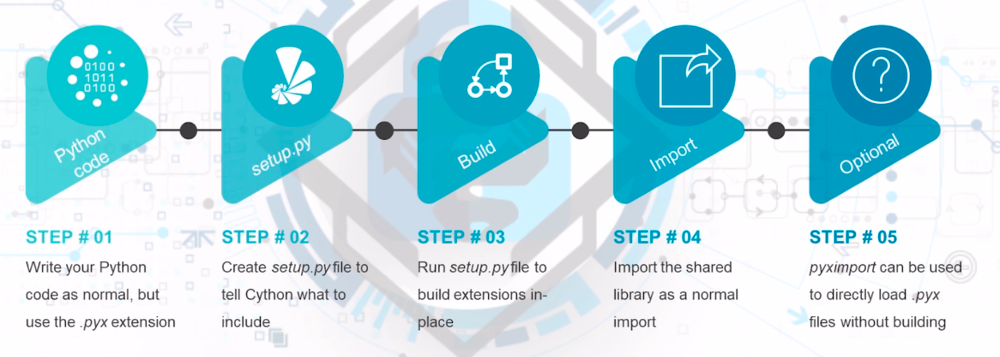

## Section Topics

### 15.1 - SWIG with C

- 01 | Building blocks
    - Hashlib, json, ctypes, os, getpass modules of python
- 02 | Developing the script
    - Putting the parts together
- 03 | Conclusion
    - A database for authentication without any knowledge of the actual sensitive
      information.


#### SWIG (Simplified Wrapper and Interface Generator)



#### Process
Install SWIG (apt install swig)

Write desired C code and header

Write SWIG interface file
* The __%module__ directive provides the name of the module used in Python
* The __%{..%}__ block provides a place to put additional code, such as header
  files or declarations into the generated wrapper code
* The %include directive provides for additional files such as headers

Create Python files
* Option 1: Manually compile C code, configure Python and link shared library
* Option 2: Use distutils to create setup.py file and automatically create
  everything

Creates a Python wrapper around C declarations

Uses: Building scripting interface to C programs; provide C code to scripting
languages.

Process: Import SWIG; write C code; write interface file; generate Python files.

#### Commands used in chapters
```
cd swig
sudo apt install swig
python3 setup.py build_ext --inplace

python3
import factorial
print(factorial.get_modulus(5))
# output = 120
print(factorial.get_modulus(5, 2))
# output = 1
print(factorial.cvar.pi_var)
# output = 3.14
```

#### Summary

SWIG
  - Creates a Python wrapper around C declarations
Uses
  - Build scripting interface to C programs; provide C code to scripting languages
Process
  - Import SWIG; write C code; write interface file, generate Python files

#### Helpful Resources

[Wrapping C/C++ for Python using SWIG)](https://www.geeksforgeeks.org/wrapping-cc-python-using-swig-set-1/?ref=gcse)

### 15.2 - Cython

- 01 | Cython Use
    - Use normal Python code to create C code
- 02 | Data Types
    - C-specific data types can be declarated, allowing mixing of Python and C types
- 03 | pyximport
    - For simple conversions, pyximport can be used to automatically load files
- 04 | C/C++
    - Both C and C++ code can be utilized, with the correct libraries

#### Cython Basics



#### Cython Process



#### pyximport

pyximport module loads .pyx files directly on import

Does not require running setup.py with every code chanfe
  * Only useful when no extra C libraries or special build setup required
Built into Cython

Not recommended to use pyximport on the user's system, due to the hooks into the
import system
  * Users are better served with Python wheels with the pre-built Cython binaries
    included

#### Commands used in chapters
```
cd cython
python3 -m venv env
source env/bin/activate
pip3 install Cython
python3 setup_hello.py build_ext --inplace

python3
import helloworld
# output = Hello World!
Ctrl + D

python3 setup_fibo.py build_ext --inplace

python3
import fib
fib.fib(9)
# output = 1
           1
           2
           3
           5
           8
Ctrl + D

python3 setup_primes.py build_ext --inplace

python3
import primes
primes.primes(50)
# output = primes.primes(50)
[2, 3, 5, 7, 11, 13, 17, 19, 23, 29, 31, 37, 41, 43, 47, 53, 59, 61, 67,71, 73, 79,
83, 89, 97, 101, 103, 107, 109, 113, 127, 131, 137, 139, 149, 151, 157, 163, 167,
173, 179, 181, 191, 193, 197, 199, 211, 223, 227, 229]
Ctrl + D

python3 setup_cpp.py build_ext --inplace

python3
import primes_cpp
primes_cpp.primes_cpp(50)
# output = [2, 3, 5, 7, 11, 13, 17, 19, 23, 29, 31, 37, 41, 43, 47, 53, 59, 61, 67,
71, 73, 79, 83, 89, 97, 101, 103, 107, 109, 113, 127, 131, 137, 139, 149, 151, 157,
163, 167, 173, 179, 181, 191, 193, 197, 199, 211, 223, 227, 229
Ctrl + D
```

#### Helpful Resources

[Cython Tutorial)](https://cython.readthedocs.io/en/latest/src/tutorial/cython_tutorial.html)
[Fibonacci Series](https://www.programmingsimplified.com/c-program-generate-fibonacci-series)

### 15.3 - Calling Go Functions

- 01 | Golang
    - Machine-code compiled language that improves on C language
- 02 | Python Integration
    - Converting Go code to C-style shared libraries allows Python to utilize
      Go functions
- 03 | Requirements
    - Currently, there are some specific requirements to integrate Go into Python

#### Go Language
Feels like Python mixed with C
  * Syntactically similar to C but includes Python-like features
With v1.5, Go compiler introduced -buildmode flag
  * Flag allows compilation of Go code to other formats, including C shared
    libraries
C shared library versions of Go can be integrated into Python like normal C-style
APIs

#### Requirements
To compile Go code to shared library, the following requirements must be met
  * Go package must be a __main__ package. The package and all dependencies will
    be put into a single binary shared project
  * Source must import the pseudo-package "C"
  * The //export comment can annotate functions that should be made accessible
    to other languages
  * An empty main function must be declared

#### Commands used in chapters
```
cd go_python
sudo apt install golang-go
python3 -m venv env
source env/bin/activate
go build -o awesome.so -buildmode=c-shared awesome.go

python3 client.py
# output = awesome.Add(12,99) = 111
           awesome.Cosine(1) = 0.540302
           awesome.Sort(74,4,122,9,12) = [4, 9, 12, 74, 122]
           Hello Python!
           log id 1
```

#### Helpful Resources

[Go Programming)](https://medium.com/learning-the-go-programming-language/calling-go-functions-from-other-languages-4c7d8bcc69bf)
