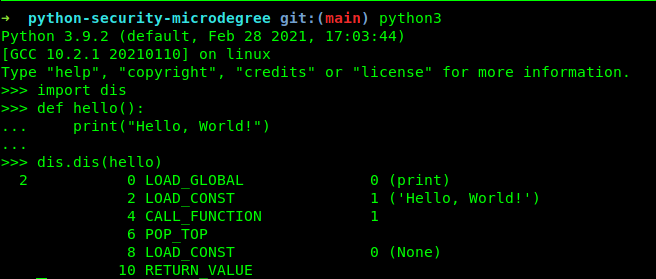
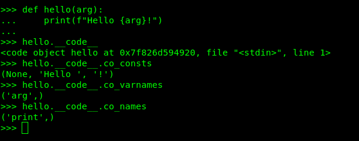
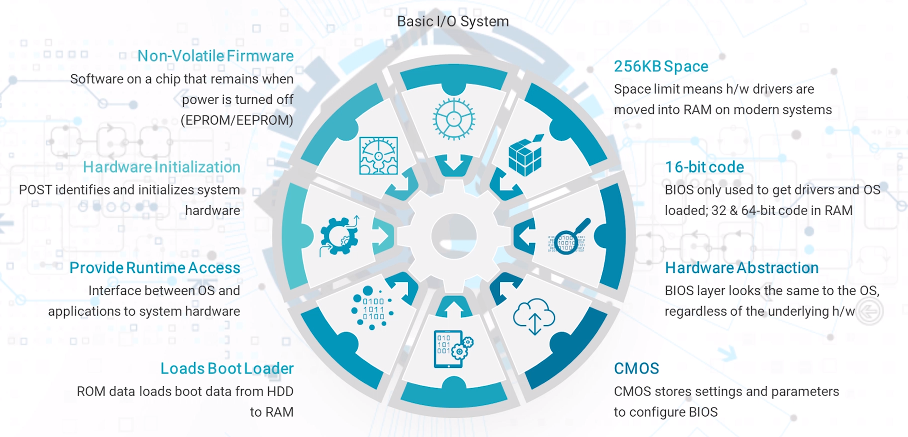
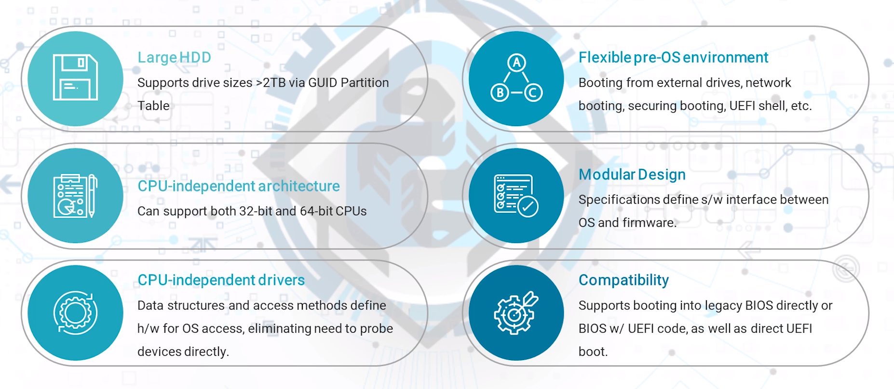
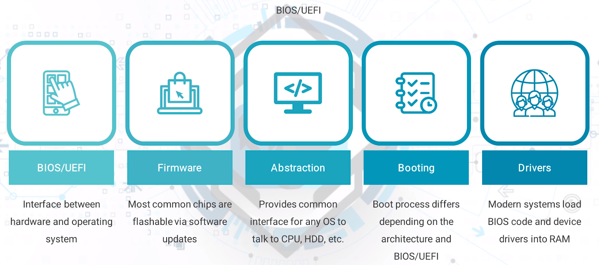

## Section Topics

### 6.1 - Operating Systems for Developers

- 01 | OS Functions
    - Operating systems handle all hardware and software on a computing device.
- 02 | Components
    - A number of components work together to make a computer OS work.
- 03 | Programmer Knowledge
    - There are a lot of high and low-level aspects of operating systems that
      developers should be aware of.

#### OS Functions

Coordinate hardware & software resource allocation

Provide common services for applications

Intermediary between hardware and software, providing time-shared access

#### OS Components

* Kernel → Most basic level of control to hardware devices
* Security → Separates allowed and not-allowed processes
* Networking → Support for various n/w protocols, hardware and applications
* User Interface → Receives and processes user input, returning appropriate results

#### What Developers Should Know (Process Management)

Process = executed program

Execution sections
  * Stack → Holds temporary data (parameters, return address, variables, etc)
  * Heap → Dynamically allocated memory for process use
  * Text → Contents of processor registers and current process acitivity
  * Data → Global aand static variables

#### What Developers Should Know (Thread)

* Flow of execution in a process
* A progress may have multiple threads
* Minimize context swithching time
* Provide concurrent programming capabilities
* Lightweight nature allows better resource use
* More effective use of multiprocessor architectures
* Allow process to continue working while waiting for data

#### What Developers Should Know (Process Communication)

Process types
  * Independent → not affected by other process execution
  * Cooperating → is affected by other process execution
Inter-process communications (IPC) allows processes to communicate status to each
other, allowing synchronizing of applications
  * Shared memory → shared memory space fır multiple processes to access for data
    storage and use
  * Message parsing → direct communications between processes using a comms link
    * Messages include sleep and wakeup calls, semaphores, conditions, etc.

#### What Developers Should Know (I/O Management)

Manages requests and returns between software and hardware
OS handles requests at kernel level but CPU not always involved
Communication types
  * Special instruction → CPU-specific instruction just for I/O control
  * Memory-mapped → Same address space is shared by memory and I/O devices
    Allows hardware to transfer data to/from memory without using CPU
  * Direct Memory Access (DMA) → I/O device has authority to read/write memory
    spaces without CPU involvement

#### What Developers Should Know (Virtualization)

Creates multiple environments on single, shared hardware platform
Allows better resource management as hardware can be utilized for more work rather
than sitting idle
Types:
  * Data → consolidates multiple data locations into a single source
  * Desktop → Deploy multiple, simulated desktops to physical machines from a
    central location
  * Server → Partitions a single server into multiple server types
  * OS → Use a single system to run multiple operating systems
  * Network functions → Separates key n/w functions for distribution among
    environments

#### What Developers Should Know (Distributed File Systems)

Allows clients to access and process server data as if it were local data

Coordinates multiple access calls to same data to prevent conflicts

Data frequently replicated to prevent data failure

#### What Developers Should Know (Distributed Shared Memory)

Provides a virtual address space that is shared among all connected computers

Data access occurs much like virtaul memory
  * Data moves between primary and secondary memory of a system
  * Data also moves between main memory of different systems

#### What Developers Should Know (Cloud Computing)

New spin on client/server networking

Computing resources are available via any Internet connection

Hardware and software administration is typically outsourced to a third party

Systems can dynamically scale as necessary, ensuring resources are always available

### 6.2 - Execution Code

- 01 | Compiling
    - Fastes execution time but compilation step can slow overall development
- 02 | Interpretation
    - Can be slower than compiled code, but quicker to program

- Compilation: Converting source code directly into machine code
- Interpretation: Converting source code to bytecode, then to machine code

#### Compilation Process

Translates source code to machine-readable code
* Step # 01: Generate source code
* Step # 02: Convert to non-optimized intermediate code
* Step # 03: Optimize intermediate code
* Step # 04: Translate intermediate code to target's machine code

#### Interpretation Process

Convert from source code to portable code
* Step # 01: Generate source code
* Step # 02: Convert from source code to bytecode
* Step # 03: Process bytecode in interpreter virtaul machine

### 6.3 - Understanding Python Bytecodes

- 01 | Python Interpreter
    - Converts source code to architecture-independent bytecode
- 02 | Bytecode
    - Utilizes stacks to process each Python function call

#### Python .pyc Files

.pyc files are Python's bytecode-compiled files

They are made from source code files

Save time by preventing Python from re-parsing source code every time (unless
something is changed)

#### How Python Works

Python converts source code to bytecode for use in a virtaul machine (the interpreter)

When first ran, .py files are converted into bytecode .pyc file

.pyc files are first accessed (if available) when a Python program is ran. If not
available or the data in the source code has changed, the .py file is re-processed
into a new .pyc file

#### A Look at Bytecode

The Python program below:
```
def hello():
  print("Hello, World!")
```
becomes the bytecode below:
```
2        0 LOAD_GLOBAL       0 (print)
         2 LOAD_CONST        1 ("Hello, World!")
         4 CALL_FUNCTION     1
```
#### Python stacks

Python uses a stack-based VM
  * Call stack: One "frame" for each active function call; bottom of the stack is
    the entry point of the program. Each function call pushes a new frame to the
    stack and each function return pops a frame off.
  * Evaluation stack: Each frame has a data avaluation stack, where function
    execution occurs. Items are pushed to stack, manipulated and popped off.
  * Block stack: Each frame also has a block stack, used to track control
    structures like loops and try/except blocks. Ensures Python knows which control
    structure is currently operating.

#### Converting to Bytecode

We call the function my_funct(arg1, 4)

The interpreter performs the following:
  * LOAD_NAME instruction looks for the my_funct object and pushes it to the top
    of the evaluation stack
  * Another LOAD_NAME looks up the variable arg1 and pushes it to the evaluation
    stack
  * A LOAD_CONST instruction pushes the literal integer 4 to the evaluation stack
  * A CALL_FUNCTION instruction is processed


##### CALL_FUNCTION
The CALL_FUNCTION and its sibling CALL_FUNCTION_KW are used to process arguments
or keyword arguments, respectively.

In the previous example, the function had two arguments, so CALL_FUNCTION will
have to pop two argument values from the stack, followed by the function call itself.

A new frame is added to the call stack, filled with function variables and the
bytecode of the function itself is executed.

When finished, the frame is popped from the call stack and the original function
call frame, filled with the return value is pushed to the evaluation stack.

#### Viewing Bytecode
The dis library is used to view bytecode.



The ```__code__``` attribute is used to view bytecode objects.



#### Why it's Useful
Knowing bytecode allows you to anticipate what your source code will become,
allowing better optimization.

You can read the actual code to see why certain Python constructs are better
choices than others.

Knowing how stack-oriented programming works broadens your knowledge.


### 6.4 - BIOS/UEFI

- 01 | BIOS
- 02 | UEFI

#### BIOS (Basic Input/Output System)



#### UEFI (Unified Extensible Firmware Interface)



#### Summary


