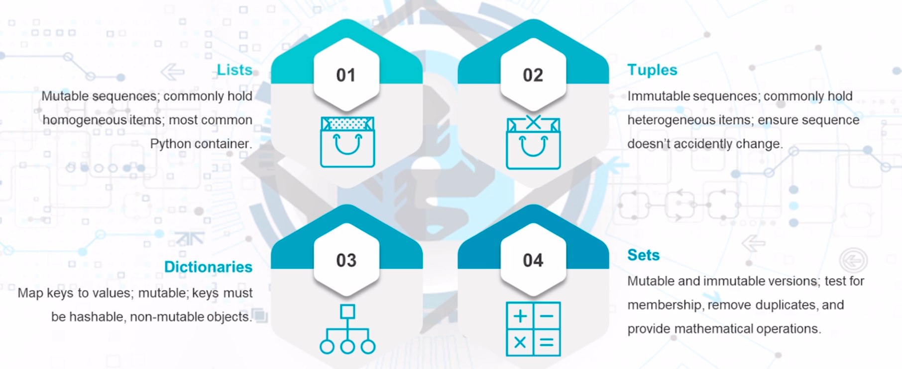

## Section Topics

### 8.1 - Python Collections

- 01 | Sequences
    - Mutable lists and immutable tuples with associated methods
- 02 | Dictionaries
    - Hashable mappings and associated methods
- 03 | Sets
    - Mutable sets and immutable sets with associated methods

#### What are Collections?
Improving Python Containers


#### Container Review
Containers that have associated Collections



#### Sequences: Common Operations

* x in s: Returns true if an item in sequence s is equeal to x; otherwise it returns
  false
* x not in s: Returns true if no item in sequence s is equeal to x; otherwise it
  returns false
* s + t: Concatenates sequence s with sequence t
  - Concatenating immutable sequences creates a new object
* s * n: This adds s to itself n times
  - Items in the sequence are not copied, but referenced multiple times
* s[i]: This retrieves the ith item in sequence s, starting from the 0th index
  - Negative numbers start counting from the end of the sequence
* s[i:j]: This retrieves a slice of s, from i (inclusive) to j (exclusive)
* s[i:j:k]: This retrieves a slice from s, from i to j, skipping k times
* len(s): This returns the length of s
* min(s): This returns the smallest item in s
* max(s): This returns the largest item in s
* s.index(x[, i[, j]]): This indexes the first instance of x in s; optionally
  it returns x at or after index i and (optionally) before index j
* s.count(x): This returns the total count of x instances in s

#### Mutable Sequence Operations

* s[i] = x: This replaces the object at index position i with object x
* s[i:j] = t: The slice from i (inclusive) to j (exclusive) is replaced with the
  contents of object t
* del s[i:j]: This deletes the contents of s from indexes i to j
* s[i:j:k] = t: This replaces the slice of i to j (stepping by k) by object t
  (t must have the same length as s)
* del s[i,j,k]: This deletes elements of the sequence as determined by the slice
  indexes and stepping, if present
* s.append(x): This adds x to the end of s
* s.clear(): This deletes all elements from the sequence
* s.copy(): This is used to shallow copy of s
* s.extend(t): Extends s with the contents of t (can also use s += t)
* s *= n: This is used to update w with its contents repeated n times
* s.insert(i, x): This inserts x into s at position i
* s.pop([i]): Extract an item at index i from s, returning it as a result and
  removing it from s (defaults to removing the last item from s)
  s.remove(x): Delete the first item from s that matches x (throws an exception if
  x is not present)
* s.reverse(): Reverse s in-place

#### Dictionaries

* len(d): This returns the number of items in a dictionary
* d[key]: This return the value associated with key
* d[key] = value: This is used to set the mapping of key to value
* del d[key]: This deletes the value associated with key
* key in d: If key exists in the dictionary, return true, otherwise return False
* key not in d: If key exists in the dictionary, return False; otherwise return True
* iter(d): This returns an iterator object from the dictionary keys. To actually
  use the iterated keys, you must use a for loop
* clear(): This removes all items from the dictionary
* copy(): This returns a shallow copy of the dictionary
* fromkeys(seq[, value]): This creates a new dictionary using the keys listed in
  seq and sets their values to value. If no value is provided, it defaults to None
* get(key[, default]): This returns the value associated with key, if key exists.
  Otherwise, the default value is returned. If default is not set, then None is
  returned, that is no response, but not an error
* items(): This returns a view object of the key:value pairs in the dictionary
* keys(): This returns a view object of just the dictionary keys
* pop(key[, default]): This is used if key exists in the dictionary; remove it
  from the dictionary and return its value; otherwise return default. If default
  isn't provided and the key doesn't exist, then an error is raised
* popitem(): This removes and returns an arbitrary pair from the dictionary. As
  Dictionaries are unsorted, the returned pair is effectively randomly selected
* setdefault(key[, default]): This is used if key is present in the dictionary,
  return its value. If not present then make a new key:value pair with the provided
  key and the default value. If default isn't set, it defaults to None
* update([other]): This modifies the dictionary by updating it with the pairs from
  other. If existing keys are present, they will be overwritten. Other can be
  another dictionary or an iterable object of key:value pairs such as a tuple
* values(): This returns a view object of the dictionaries values

#### Dictionary Views

* Dictionary views are dynamic objects that show the dictionary's items and are
  automatically updated whenever the dictionary is modified
* len(dictview): This returns the number of items in a dictionary
* item(dictview): This returns an iterator object over the dictionary keys,
  values or key:value pairs
* x in dictview: This returns True if x exists within the view object

#### Sets & Frozensets

* len(s): This returns the number of items in set s
* x in s: This returns True if x exists in s; otherwise it is False
* x not in s: This returns False if x exists in s; otherwise it is True
* isdisjoint(other): This returns True if the set has no elements in common with
  object other
* issubset(other): This tests whether all elements in the set are also in other
* issuperset(other): This tests whether all elements in other are also in set
* union(* others): This returns a new set that only contains object that are in
  common between the set and all other objects
* difference(*others): This returns a new set that is only the elements that
  exists in the set, but are not in others
* symmetric_different(other): This returns a new set of elements that are either
  in set or other but not both
* copy(): This returns a new set with a shallow copy of the set

#### Mutable Sets

* update(*others): This updates the set by adding elements from all others
* intersection_update(*others): This updates the set by keeping only the elements
  that are in the set and others
* difference_update(*others): This updates the set by keeping only the elements
  found in others
* symmetric_difference_update(other): This updates the set with only the elements
  found in either set or other, but not common to both
* add(elem): This adds elem to the set
* remove(elem): This deletes elem from the set; it throws an exception if elem
  is not present
* discard(elem): This deletes elem from the set if present

### 8.2 - OrderedDict

- 01 | OrderedDict
    - Largely deprecated in Python 3.7
- 02 | Methods
    - Three OrderedDict methods are still useful
- 03 | Examples
    - Demonstrated how normal dictionaries compare to OrderedDict collection

#### OrderedDict

Mostly redundant as of Python 3.7
  * Normal dictionaries automatically implement insertion order preservation
The methods of OrderedDict are still useful, as regular dictionaries don't include
them

#### OrderedDict Methods

* popitem(last=True): It returns and removes the key:value pair at the end of the
  dictionary. If last is not provided or manually set to True, then the popped
  value is LIFO (last in, first out). If last is set to False, then the popped
  value is FIFO.
* move_to_end(key, last=True): It moves the provided key to the end of the dictionary.
  If last is set to True, then the key moves to the right. If last is set to False,
  the key is sent to the front. If the key does not exist, an error is generated
* reversed(): Since OrderedDict objects are in order, they can be manipulated like
  an iterable object; in this case reverse iteration can be performed on an OrderedDict

#### Commands used in chapters
```
python3 ordereddict.py
# output = Normal dict: {'banana': 3, 'apple': 4, 'pear': 1, 'orange': 2}
           Pop last item: ('orange', 2)
           Invalid method call
           OrderedDict([('banana', 3), ('apple', 4), ('pear', 1), ('orange', 2)])
           OrderedDict([('banana', 3), ('apple', 4), ('pear', 1), ('orange', 2)])
           Print dict: OrderedDict([('banana', 3), ('pear', 1), ('orange', 2), ('apple', 4)])
           apple
           orange
           pear
           banana
```

### 8.3 - DefaultDict

- 01 | defaultdict
    - Handles missing values to prevent errors
- 02 | Methods
    - ```missing()``` and __default_factory handle default conditions for
      missing values
- 03 | Examples
    - Demonstrated how defaultdict can be used in a variety of situations

#### DefaultDict

* Creates a factory function to provide missing values
* If a dictionary item doesn't exists, it will create a default item when called
* Helps prevent KeyError exceptions when accessing a non-existent key

#### DefaultDict Methods

* ```__missing__(key)```: This method is used by the dict class ```__getitem__()```
  method when the requested key is not found. Whatever key it returns (or an
  exception if no key is present) is passed to ```__getitem__()```, which processes
  it accordingly.
* ```__default_factory```: While not a method, it is used as an attribute for
  the ```__missing__()``` method, it is initialized by the first argument to the
  dictionary constructor, if available; defaults to None if no argument is provided.

#### Commands used in chapters
```
python3 defaultdict.py
# output = [('blue', [2, 4]), ('red', [1]), ('yellow', [1, 3])]

python3 defaultdict_counter.py
# output: [(' ', 2), ('A', 1), ('M', 1), ('a', 4), ('b', 1), ('d', 1), ('i', 4), ('l', 1), ('m', 1), ('n', 1), ('p', 2), ('s', 4)]

python3 defaultdict_lambda.py
# output: Marry ran to <value_unknow>

python3 defaultdict_set.py
# output: [('apple', {1}), ('banana', {3, 4}), ('carrot', {1, 3})]

python3 defaultdict_list.py
# output: [('blue', [2, 4]), ('red', [1]), ('yellow', [1, 3])]
```

### 8.4 - UserDict

- 01 | UserDict
    - Largely deprecated except for legacy support
- 02 | Dictionary access
    - ```data``` attribute provides access to underlying dictionary
- 03 | Data
    - Accessed like a dictionary but return object is actual dictionary object,
      not tuple of key:value pairs

#### UserDict

* Wrapper to dict class that makes it easier to subclass dict
* Primarly used for backwards-compatibility as UserDict simulates a dictionary,
  with the contents available via UserDict.data
* Since normal dictionaries can now be subclassed, this collection is largely
  deprecated for most programs

#### Commands used in chapter
```
python3 userdict.py
#output = {'a': 1}
          {'d': 3}
          {'a': 1}
          d 3
          a 1
          dict_items([('d', 3)])
          ItemsView({'a': 1})
```

### 8.5 - UserList

- 01 | UserList
    - Wrapper around lists for new functionally
- 02 | Deprecated
    - Ability to subclass normal lists means UserList is largely unnecessary
- 03 | Data
    - Like UserDict, a data attribute holds the underlying list object contents

#### UserList

* Similar to UserDict, except it applies to lists rather than dictionaries
* Primarly used to create a base class for list-like subclasses
  - Allows for inheritance, method overriding and new methods to provide new
    functionally to lists
* Largely deprecated due to normal lists allowing subclassing now
  - Still useful as it is sometimes easier to use UserList than subclass list

#### Commands used in chapter
```
python3 userlist.py
# output
Unmodified list: [0, 1, 2, 3, 4, 5, 6, 7, 8, 9]
Modified last value: [0, 1, 2, 3, 4, 5, 6, 7, 8, 9, 10]
Modified index 2: [0, 1, 42, 3, 4, 5, 6, 7, 8, 9, 10]
Traceback (most recent call last):
  File "/home/sedacaglar/Desktop/mygithub/python-security-microdegree/8-python-collections/userlist.py", line 25, in <module>
    ext_list[12] = 90 # Accessing index beyond list length results in error
  File "/home/sedacaglar/Desktop/mygithub/python-security-microdegree/8-python-collections/userlist.py", line 13, in __setitem__
    self.data[key] = value
IndexError: list assignment index out of range
```

### 8.6 - UserString

- 01 | UserString
    - Largely deprecated except for legacy support
- 02 | Object class
    - "data" attribute provides access to underlying string object
- 03 | Use
    - Allows functionality enhancement for strings, such as providing other
      sequence methods

#### UserString

* Wrapper to string class that makes it easier to subclass strings
* Primarly used for backwards-compatibility
* Since normal string class can now be subclassed, this collection is largely
  deprecated for most programs
  - Also useful when subclassing string is too much work for a simple project
* Like UserDict and UserList, a data attribute is used to access the underlying
  string object

#### Commands used in chapter
```
python3 userstring.py
# output
banana-fosterspam and pineapples
Traceback (most recent call last):
  File "/home/sedacaglar/Desktop/mygithub/python-security-microdegree/8-python-collections/userstring.py", line 15, in <module>
    new_s.append("apples") # Normal strings don't have append() function
AttributeError: 'str' object has no attribute 'append'
```