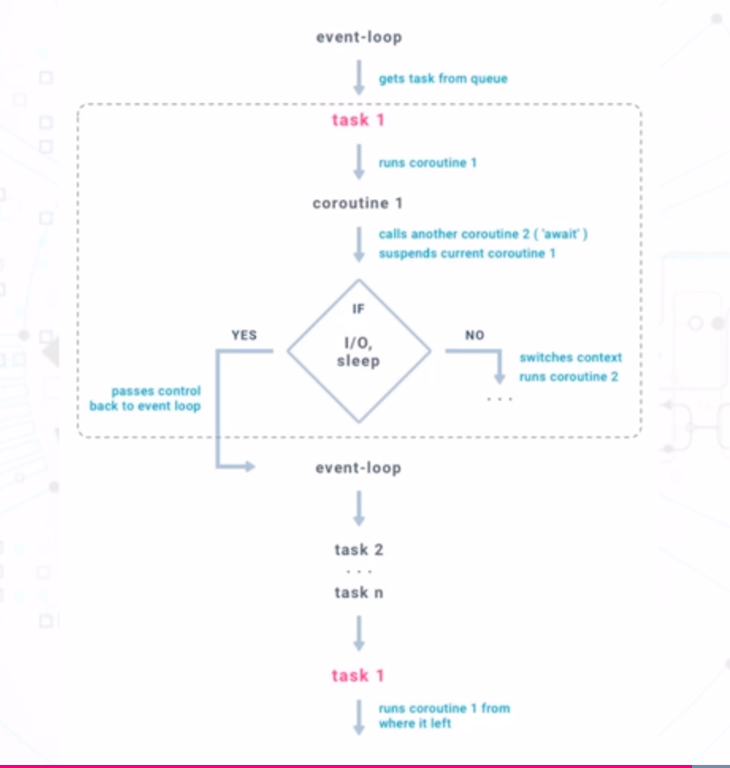

## Section Topics

### 9.1 - What is Parallelism

#### Parallel Processing - Defined

Parallel processing simply means having something done by __multiple agents
simultaneously__.

### 9.2 - First Example in Python

#### Commands used in chapters
```
python3 countdown_sequential.py
# output
Alice is counting down: 5...
Alice is counting down: 4...
Alice is counting down: 3...
Alice is counting down: 2...
Alice is counting down: 1...
Alice finished counting down
Bob is counting down: 5...
Bob is counting down: 4...
Bob is counting down: 3...
Bob is counting down: 2...
Bob is counting down: 1...
Bob finished counting down

python3 countdown_multiprocessing.py
# output
Process Alice is counting down: 5...
Process Alice is counting down: 4...
Process Bob is counting down: 5...
Process Alice is counting down: 3...
Process Bob is counting down: 4...
Process Alice is counting down: 2...
Process Alice is counting down: 1...
Process Alice finished counting down
Process Bob is counting down: 3...
Process Bob is counting down: 2...
Process Bob is counting down: 1...
Process Bob finished counting down
```

### 9.3 - Python Parallelism in Context

- 01 | Definition
    - What parallelism realy is, how it offers speed and responsiveness
- 02 | Current State
    - How parallelism is being used in today's industry
- 03 | Considerations
    - Not all programs can be made parallel

#### Parallelism vs. Concurrency

__Parallelism:__ independent components running separately from each other

__Concurrency:__ components running separately with coordination

#### Parallelism in Today's Industry

__Computer:__ Multi core computers and laptops for smoother processing

__Mobile:__ Multi-core phones, game consoles, Raspberry Pis

__The Web:__ Multi-server websites, servers handle multiple requests simultaneously

__Al & ML:__ GPUs, splitting training data, multi-agent learning

#### Before Applying Parallelism...

* Is the program inherently sequential?
* Which parts of the program can be made parallel?
* What is the best number of threads/processes to run in parallel?

### 9.4 - What is Threading

#### A Thread & Threading

__A thread:__ The smallest unit of executable commands managed by a scheduler.

__Threading:__ Running multiple threads at the same time.

#### Commands used in chapters
```
python3 countdown_threading_v1.py
# output
Thread Alice is counting down: 5...
Thread Alice is counting down: 4...
Thread Bob is counting down: 5...
Thread Alice is counting down: 3...
Thread Bob is counting down: 4...
Thread Alice is counting down: 2...
Thread Alice is counting down: 1...
Thread Alice finished counting down
Thread Bob is counting down: 3...
Thread Bob is counting down: 2...
Thread Bob is counting down: 1...
Thread Bob finished counting down

python3 countdown_threading_v2.py
# output
Thread Alice starting...
Thread Bob starting...
Thread Alice is counting down: 5...
Thread Alice is counting down: 4...
Thread Bob is counting down: 5...
Thread Alice is counting down: 3...
Thread Bob is counting down: 4...
Thread Alice is counting down: 2...
Thread Alice is counting down: 1...
Thread Alice finished counting down
Thread Alice finished
Thread Bob is counting down: 3...
Thread Bob is counting down: 2...
Thread Bob is counting down: 1...
Thread Bob finished counting down
Thread Bob finished
```
### Helpful Resources

[Threading](https://docs.python.org/3/library/threading.html)

### 9.5 - Building a Thread Ping Test

#### Web Requests via A Browser


#### Pinging A Website


#### HTTP Status Codes
- __1xx (Informational):__ The request was received, continuing processes
- __2xx (Successful):__ The request was successfully receivedi understood and
  accepted
- __3xx (Redirection):__ Further action needs to be taken in order to complete
  the request
- __4xx (Client Error):__ The request contains bad syntax or cannot be fulfilled
- __5xx (Server Error):__ The server failed to fulfill an apparently valid request

#### Commands used in chapters
```
python3 ping_sequential.py
# output
http://httpstat.us/200:OK
http://httpstat.us/200?sleep=2000:OK
http://httpstat.us/404:Not Found
http://httpstat.us/500?sleep=3000:Internal Server Error
http://httpstat.us/524:A Timeout Occurred

python3 ping_threading.py
# output
http://httpstat.us/524:A Timeout Occurred
http://httpstat.us/404:Not Found
http://httpstat.us/200:OK
http://httpstat.us/200?sleep=2000:OK
http://httpstat.us/500?sleep=3000:Internal Server Error
```
### Helpful Resources

[Python Requests](https://docs.python-requests.org/en/latest/)

[HTTP Status](http://httpstat.us/)

### 9.6 - The Global Interpreter Lock

#### The GIL CPU-Bound Tasks

* The GIL prevents multiple CPU-bound threads from executing simultaneously
* A CPU-bound program mostly executes inside the CPU
* Typically involves heavy computation, also referred to as __"compute-bound"__

#### Commands used in chapters
```
 python3 big_countdown_sequential.py

 python3 big_countdown_threading.py
```

#### Arguments For The GIL
* Not all threaded programs are affected by the GIL
    - Sleeping
    - Waiting for responses from online server
* Best solution to memory management in Python
* Responsiveness resulting from threading is still possible

### Helpful Resources

[Gilectomy](https://pythoncapi.readthedocs.io/gilectomy.html)

### 9.7 - Multi-Processing in Python

#### Process vs. Programs

__A processes:__ an istance of a program being executed by the operating system

Different instances of a program can be run in seperate processes at the same time

#### Multiprocessing vs. Threading

* A thread is a part of and more lightweight than a process
* Threading takes place in a common process
* Multiprocessing involves multiple processes running in seperate processors
* No coordination between processes
* Multiprocessing is more expensive than threading
* No GIL in Multiprocessing

### 9.8 - Building a Multiprocessing Image Processor

#### Computer Images & Pixels

* Each image is a matrix of pixels
* Each pixel is a single-colored square


#### RGB Coloring Scheme

* Each color can be represented as a combination of red, green and blue
* Each value can range from 0 to 255
For example:
- Red: (255, 0, 0)
- Yellow: (255, 255, 0)

#### Commands used in chapters
```
python3 -m venv env
source env/bin/activate
pip3 install numpy matplotlib pillow
python3 img_sequential.py

python3 image_multiproccesing.py
```
#### Section Summary
* Definition: What a process really is, how Multiprocessing is implemented.
* Image Processing: Making heavy calculations simultaneously via multiprocessing.
* Example: A quick example in Python.
* Process Pools: Keeping the number of running processes fixed.

### 9.9 - The Advantages of Using Locks

#### Race Conditions

* Multiple threads interacting with a shared resource at the same time without
coordination.

* Updates from one thread to the resource might be overwritten by updates from
another.


#### Locks & Their Effects

* Locks are placed on shared resources that are updated by more than one thread.

* Once a lock has been acquired by a thread, no other thread can access the
corresponding resource until the lock is released.


#### Commands used in chapters
```
python3 counter_race.py
# output
Final counter value: 13

python3 counter_lock.py
# output
Final counter value: 20
```

### 9.10 - The Disadvantages of Using Locks

#### Locks Cause Sequentiality


#### The Dining Philosophers Problem

* Each philosopher always alternates between eating and thinking and they go on
like that forever.

* If a philosopher wants to start eating, he will need to use both forks and a
fork can only be used by at most one philosopher at a time.


#### A Naive Approach

* Each philosopher picks up his left fork as soon as it becomes available.

* If a philosopher is holding his left fork, he picks up his right fork as soon
as it becomes available.

* Once a philosopher has both forks, he eats for a specific amount of time and
places both forks down afterwards.

Problem: Everyone only has his left fork.

#### Starvation


#### Commands used in chapters
```
sample_deadlock.py
# output
Task 1 is starting...
Task 2 is starting...
Task 2 is waiting to acquire Lock A
Task 1 is waiting to acquire Lock A
Task 1 has acquired Lock A
Task 2 has acquired Lock B
Task 2 is doing some calculations
Task 1 is doing some calculations
Task 1 is waiting to acquire Lock B
Task 2 is waiting to acquire Lock A
```

#### Section Summary
* Definition: What a lock really is, how a lock is implemented.
* Pros: Avoiding race conditions using locks.
* Example: A quick example in Python.
* Cons: Sequentiality, deadlock, starvation.

### 9.11 - What is Asynchronous Programming

#### A Naive Strategy in Simultaneous Chess
* Kasparov takes 3 minutes to make a move.
* Each oppenent takes 5 minutes to make a move
* Each match lasts for 20 moves from each player (40 moves in total)

__Sequential approach:__

 (20 moves * 3 minutes + 20 moves * 5 minutes) * 10 oppenents = 1600 minutes

#### No-Waiting Strategy
Instead of waiting for an oppenent to think about and make his move, Kasparov will
move simply move on to the next oppenent after making a move.

30 minutes * 20 moves = 10 hours

__Asynchronous Programming: overlapping waiting time and processing time.__

#### Asynchronous Programming in Python

Elements of Asynchronous Programming


#### Thread


#### Commands used in chapters
```
python3 countdown_async.py
# output
Coroutine Alice is counting down: 5...
Coroutine Bob is counting down: 5...
Coroutine Alice is counting down: 4...
Coroutine Alice is counting down: 3...
Coroutine Bob is counting down: 4...
Coroutine Alice is counting down: 2...
Coroutine Alice is counting down: 1...
Coroutine Alice finished counting down
Coroutine Bob is counting down: 3...
Coroutine Bob is counting down: 2...
Coroutine Bob is counting down: 1...
Coroutine Bob finished counting down
```

### 9.12 - Building an Asynchronous Web Scraper

__The Idea of Web Scraping__


#### Asynchronous Web Scraping


#### Commands used in chapters
```
pip3 install aiohttp aiofiles requests

python3 scrape_sequential.py

python3 scrape_async.py
```

#### Section Summary
* Definition: What asynchronous programming really is.
* Differences with traditional parallelism: How it is different from threading
  and multiprocessing
* Example: A quick example in Python.
* Asynchronous web scraping: Making web requests and writing to file asynchronously.
